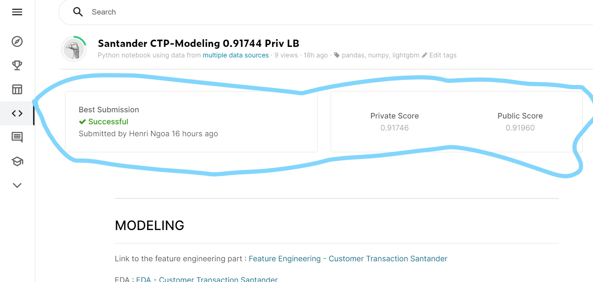
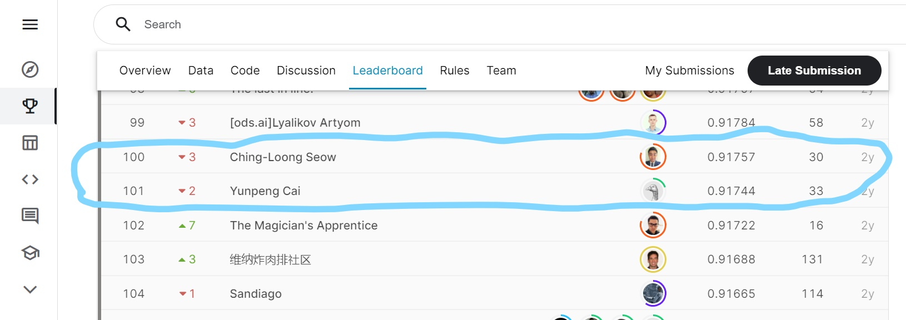

# Kaggle Competition:  [Santander Customer Transaction Prediction](https://www.kaggle.com/c/santander-customer-transaction-prediction/overview)
---

### Competition introduction
*At Santander our mission is to help people and businesses prosper. We are always looking for ways to help our customers understand their financial health and identify which products and services might help them achieve their monetary goals.*

*Our data science team is continually challenging our machine learning algorithms, working with the global data science community to make sure we can more accurately identify new ways to solve our most common challenge, binary classification problems such as: is a customer satisfied? Will a customer buy this product? Can a customer pay this loan?*

*In this challenge, we invite Kagglers to help us identify which customers will make a specific transaction in the future, irrespective of the amount of money transacted. The data provided for this competition has the same structure as the real data we have available to solve this problem.*

---
Here you can find the **EDA, the Feature Engineering and the Modeling** tasks I performed for this completed competition.

My model achieved a private score that would have placed me **101st in the leaderboard, out of 8700 teams (top 1.15%)**, if the competition had still been running.

[My Kaggle kernels for this competition](https://www.kaggle.com/jamesngoa/code)

[My verified score by Kaggle of 0.91746](https://www.kaggle.com/jamesngoa/santander-ctp-modeling-0-917-priv-lb)

 

 

[Private leaderboard of the competition *Customer Transaction Prediction*](https://www.kaggle.com/c/santander-customer-transaction-prediction/leaderboard) (would be right after the 100th with my model AUC score of 0.91746)

 

 

